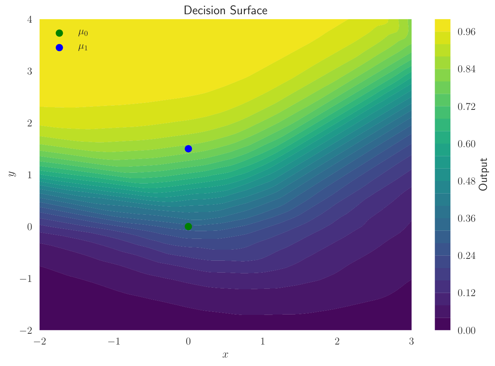
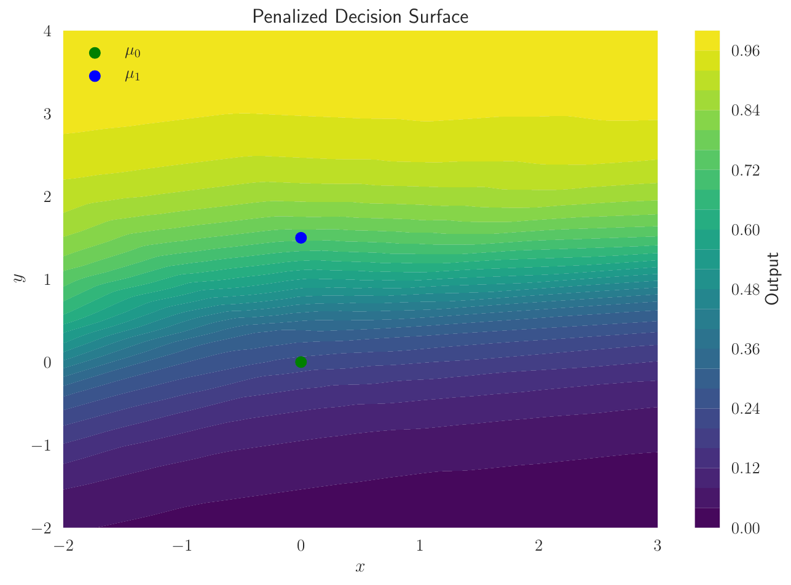

# Invariant Representations
Learning invariant representations with mutual information regularization

 

* [Toy Example](https://nbviewer.jupyter.org/github/Justin-Tan/invariant_reps/blob/master/notebooks/toy_MI.ipynb)
* [Toy Example on Binder](https://hub.mybinder.org/user/justin-tan-invariant_reps-iqsxl56t/notebooks/notebooks/toy_MI.ipynb)

### Dependencies
* Python 3.6
* [Pandas](https://pandas.pydata.org/)
* [TensorFlow 1.13](https://github.com/tensorflow/tensorflow)
* [Tensorflow Probability](https://www.tensorflow.org/probability)

### Resources / Related Work
* [Slides describing the method](https://indico.cern.ch/event/766872/contributions/3357989/)
* [Learning to pivot with adversarial networks](https://arxiv.org/abs/1611.01046)

### Future Work
* Increase stability of MI estimator.
* Include HEP example.

### Contact
Feel free to open an issue or ping [justin.tan@coepp.org.au](mailto:justin.tan@coepp.org.au) for any questions.

